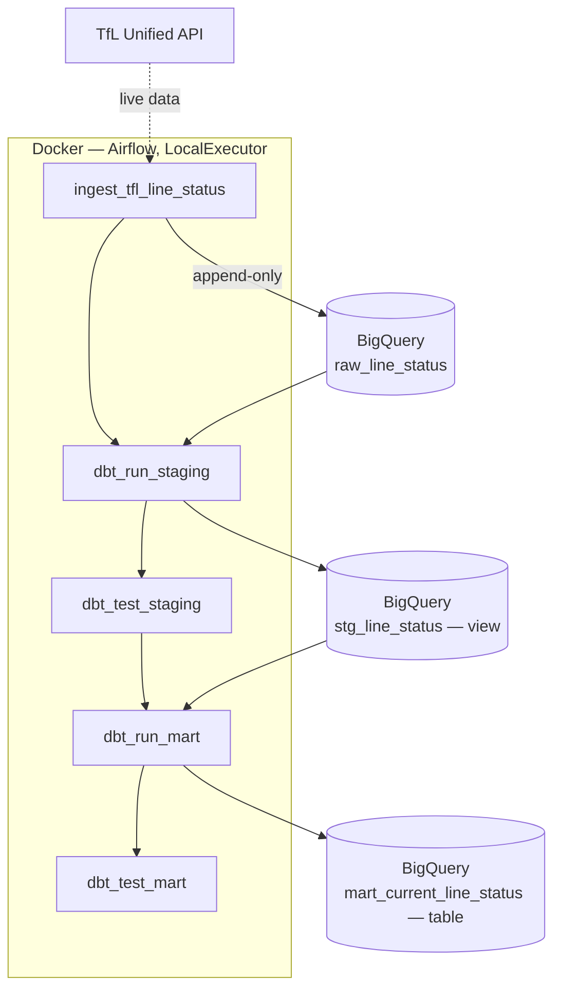

# TfL Airflow + dbt Pipeline


A batch pipeline ingesting live Transport for London (TfL) Unified API data, orchestrated with Apache Airflow, transformed with dbt, and loaded into BigQuery — running on a daily schedule, fully containerized, tested, and CI-checked.

Companion project to [aws-financial-data-lake](https://github.com/aksalunke/aws-financial-data-lake), demonstrating the same data engineering discipline with a Python-native, cloud-agnostic stack rather than managed AWS services — Airflow instead of Glue Workflows,
dbt instead of PySpark transformations, BigQuery instead of S3 zones.

---

## What It Does

Every day at 6am UTC, Airflow triggers a five-task pipeline: a Python script pulls the live status of every London Underground line from TfL's API and appends it to BigQuery, then dbt cleans that data into a tested staging layer, then aggregates it into a mart answering "what's
the tube status right now" — with a test suite validating data quality at every stage.



Any task failing stops everything downstream — dbt never runs against a failed ingest, mart never builds on untested staging data.

---

## Stack

| Layer | Tool |
|---|---|
| Orchestration | Apache Airflow 3.3.0 (LocalExecutor) |
| Transformation | dbt-core 1.12.0 (dbt-bigquery adapter) |
| Warehouse | Google BigQuery |
| Ingestion | Python 3.13, `requests`, `google-cloud-bigquery` |
| Containerization | Docker Compose, custom Airflow image |
| Testing | pytest, `unittest.mock` |
| Linting / typing | ruff, mypy |
| CI | GitHub Actions |

---

## Repo Structure

```
tfl-airflow-dbt-pipeline/
├── .github/workflows/ci.yml
├── dags/
│   └── tfl_pipeline_dag.py
├── dbt/tfl_pipeline/
│   ├── models/
│   │   ├── staging/          # sources.yml, stg_line_status.sql, tests
│   │   └── mart/              # mart_current_line_status.sql, tests
│   └── dbt_project.yml
├── ingestion/
│   ├── tfl_ingest.py
│   └── requirements.txt
├── tests/
│   └── test_tfl_ingest.py
├── docs/
│   ├── architecture-decisions.md   # why, for every real design choice
│   ├── data-notes.md               # bugs hit and fixed, as they happened
│   └── SETUP.md                    # full rebuild-from-scratch runbook
├── Dockerfile
├── docker-compose.yaml
├── pyproject.toml
└── requirements-dev.txt
```

---

## Getting Started

Full environment setup — Python, WSL 2, Docker, GCP credentials, Airflow, dbt, all of it — is documented step by step in **[`docs/SETUP.md`](docs/SETUP.md)**, written as a genuine runbook: follow it top to bottom on a fresh Windows machine and it reproduces this entire environment.

Quick version once set up:
```powershell
docker compose up -d                    # start Airflow
python ingestion\tfl_ingest.py          # manual ingest test
cd dbt\tfl_pipeline && dbt run && dbt test   # manual dbt test
```
Or trigger `tfl_line_status_pipeline` directly from the Airflow UI at `localhost:8080`.

---

## Testing & CI

```powershell
pytest -v          # 9 tests, ~1s, zero network calls
ruff check .
mypy ingestion\tfl_ingest.py
```

GitHub Actions runs all three on every push and PR to `main` — badge at the top of this file reflects the current state of `main`, not a point-in-time screenshot.

CI runs ruff, mypy, and pytest against the ingestion code; a syntax check on the DAG file; and `dbt run` + `dbt test` against a CI-isolated BigQuery dataset — real raw data in, disposable `tfl_ci` output, never touching what you'd actually demo (see ADR 15).

---

## Notable Design Decisions

A few worth knowing up front — full reasoning for each in `docs/architecture-decisions.md`:

- **LocalExecutor over CeleryExecutor** — the official Airflow setup defaults to Celery + Redis + 
a separate worker; on a 7.7GB host, LocalExecutor cuts the container count from 7 to 5 and is a
legitimate single-node executor choice, not a toy substitute (ADR 2) - **`dense_rank()` over `row_number()`** in the mart layer — TfL lines can genuinely carry two concurrent statuses at once; `row_number()`   would arbitrarily drop one (ADR 5, 6) 

- **ADC over hardcoded credential paths** — both the Python script and   dbt (`method: oauth`) resolve credentials via `GOOGLE_APPLICATION_CREDENTIALS`, so moving from Windows to a Linux
container needed a config change, not a code change (ADR 8)

- **`catchup=False`** — TfL's API only ever answers "right now"; backfilling past dates would just relabel today's data as historical

---

## Known Limitations

Documented honestly rather than hidden:

- **Scheduler uptime is bound to the host machine** — this runs in Docker Desktop on a personal laptop, not a cloud VM. If the machine is asleep at 6am, that day's run simply doesn't happen, and
`catchup=False` means it isn't backfilled. A managed deployment (e.g. Cloud Composer) would remove this dependency entirely. 

- **Single environment** — `dev` target/dataset only; no separate GCP project for prod, though the dbt-target pattern is in place to extend it (ADR 3)

- **No composite uniqueness test** on `mart_current_line_status` — would need the `dbt_utils` package, not yet installed

- **Single data source** — TfL's Arrivals endpoint was scoped as a planned second source but not yet built

---

## Documentation

- [`docs/architecture-decisions.md`](docs/architecture-decisions.md) — every deliberate design choice, with reasoning

- [`docs/data-notes.md`](docs/data-notes.md) — real bugs hit during the build, and how they were found and fixed

- [`docs/SETUP.md`](docs/SETUP.md) — full infrastructure runbook, tested end to end on a fresh machine